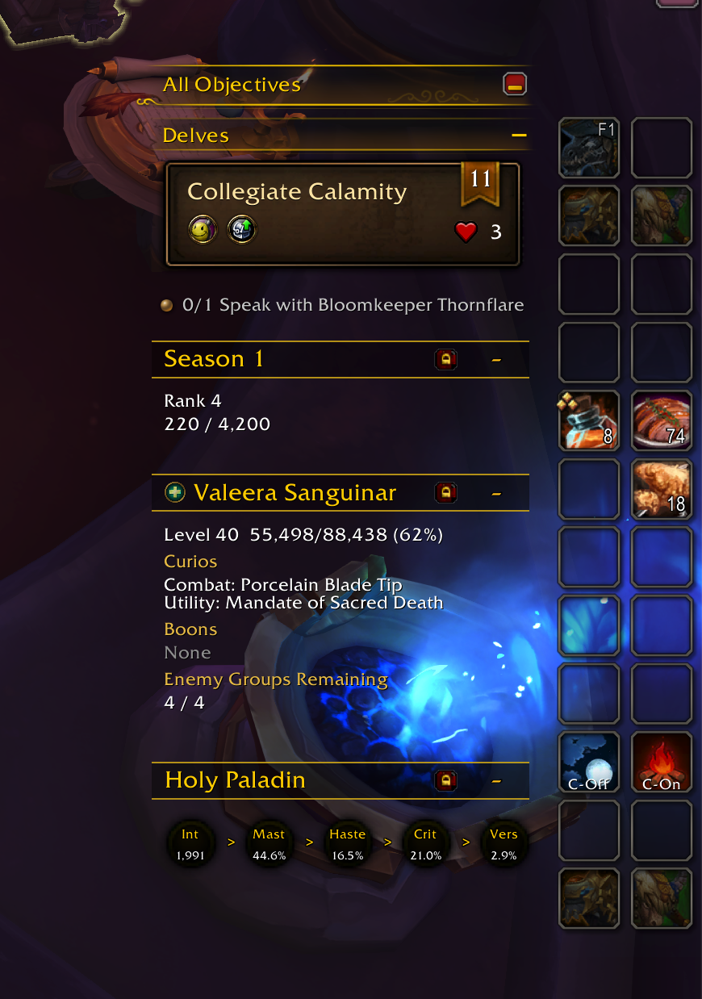
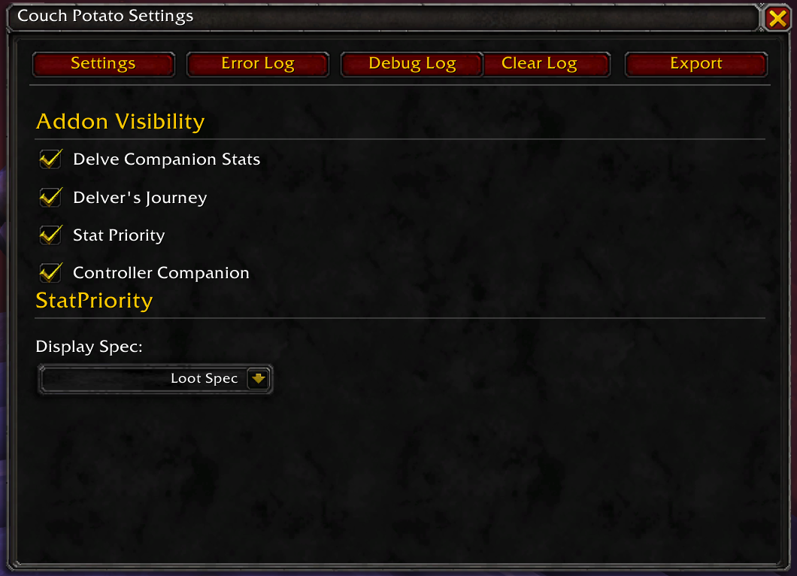

# Couch Potato

A suite of World of Warcraft addons for information panels, controller support, and more — all manageable from a single settings hub.



## Addons

### CouchPotato (Core)

Shared configuration hub and error logger for the entire suite. Adds a minimap button that opens the Couch Potato Settings panel, where you can toggle visibility of each addon, view error and debug logs, and export configuration data.



### Info Panels

A data-driven information panel engine with a graphical in-game editor. Create, preview, and share custom information displays using any WoW API — no Lua or API knowledge required.

**Built-in panels** replicate the functionality of the former StatPriority, DelveCompanionStats, and DelversJourney addons:

- **Stat Priority** — Spec-based stat priority with circle display and archon.gg URL popup
- **Delve Companion Stats** — Companion level/XP, boon stats, nemesis progress (delve-only)
- **Delver's Journey** — Season rank and XP progress (delve-only)

**Key features:**
- **Graphical editor** (`/ip editor`) — Create panels by searching for data sources with human-readable names, no API knowledge needed
- **Live preview** — See your panel update in real-time as you configure it
- **Import/Export** — Share panel configurations as compact profile strings
- **Any WoW API** — Bind panels to any data the game client exposes, with automatic validation and error handling

### Controller Companion

BG3-inspired radial controller UI for World of Warcraft. Uses a two-component loader system:

- **ControllerCompanion_Loader** — Always enabled, lightweight gamepad detection. Automatically loads the main addon when a controller is detected.
- **ControllerCompanion** — Load-on-demand. Full radial UI with action wheels, trigger peek/lock behavior, DualSense LED integration, haptic feedback, heal mode, and virtual cursor.

This keeps WoW's memory footprint minimal for keyboard/mouse players while providing full controller support on demand.

## Discord Bot

A standalone Discord bot that generates InfoPanels import strings from natural-language descriptions. See `discord-bot/README.md` for setup instructions.

---

## Built-in Panel Import Strings

If you delete a built-in panel and want it back, paste these strings into `/ip import`.

### Stat Priority

Shows spec-based stat priority with circle display and live stat values.

```
!IP:1!e192PTEsZGF0YUVudHJ5PXt7ZGVzY3JpcHRpb249IlBhc3RlIHN0YXQgcHJpb3JpdGllcyBmcm9tIGFyY2hvbi5nZyIsZm9ybWF0PSJ0ZXh0Iix0eXBlPSJwYXN0ZV9ib3gifSx7ZGVzY3JpcHRpb249IkRyYWcgc3RhdHMgdG8gcmVvcmRlciBwcmlvcml0eSIsdHlwZT0iZHJhZ19yZW9yZGVyIn19LGF1dGhvcj0iQ291Y2hQb3RhdG8gQWRkb25zIixsYXlvdXREYXRhPXtjaXJjbGVTaXplPTQ2LGNvbm5lY3RvcldpZHRoPTh9LGV2ZW50cz17IlBMQVlFUl9TUEVDSUFMSVpBVElPTl9DSEFOR0VEIiwiUExBWUVSX0xPR0lOIiwiUExBWUVSX0xPT1RfU1BFQ19VUERBVEVEIiwiVU5JVF9TVEFUUyIsIkNPTUJBVF9SQVRJTkdfVVBEQVRFIiwiUVVFU1RfV0FUQ0hfTElTVF9DSEFOR0VEIiwiUExBWUVSX0VOVEVSSU5HX1dPUkxEIiwiUVVFU1RfTE9HX1VQREFURSIsIlpPTkVfQ0hBTkdFRF9ORVdfQVJFQSJ9LHBhbmVsVHlwZT0iY2lyY2xlX3JvdyIsZGVzY3JpcHRpb249IlNob3dzIHN0YXQgcHJpb3JpdHkgZm9yIHlvdXIgY3VycmVudCBzcGVjaWFsaXphdGlvbiB3aXRoIGxpdmUgc3RhdCB2YWx1ZXMiLHRhZ3M9eyJzdGF0LXByaW9yaXR5Iiwic3RhdHMiLCJkcHMiLCJ0YW5rIiwiaGVhbGVyIn0sdWlkPSJTUF9idWlsdGluMDEiLHN0YXRzPXsiU3RyIiwiQ3JpdCIsIkhhc3RlIiwiTWFzdCIsIlZlcnMifSx0aXRsZT0iQXJtcyBXYXJyaW9yIixnYXA9LTE0LGlkPSJzdGF0X3ByaW9yaXR5In0=
```

### Delve Companion Stats

Shows companion name, level, XP, boons, and enemy group progress (delve-only).

```
!IP:1!e192PTEsc2VjdGlvbnM9e3tzb3VyY2VJZD0iZGVsdmUuY29tcGFuaW9uLm5hbWUiLGRlZmF1bHRUZXh0PSJDb21wYW5pb24iLGhlaWdodD0xNn0se3NvdXJjZUlkPSJkZWx2ZS5jb21wYW5pb24ubGV2ZWx0ZXh0IixkZWZhdWx0VGV4dD0iTGV2ZWwgPyIsaGVpZ2h0PTE4fSx7c291cmNlSWQ9ImRlbHZlLmNvbXBhbmlvbi54cHRleHQiLGRlZmF1bHRUZXh0PSIiLGhlaWdodD0xNn0se2RlZmF1bHRUZXh0PSJ8Y2ZmRkZEMTAwQm9vbnM6fHIiLGhlaWdodD0xNixpc0hlYWRlcj10cnVlfSx7c291cmNlSWQ9ImRlbHZlLmNvbXBhbmlvbi5ib29ucyIsZGVmYXVsdFRleHQ9IiIsaGVpZ2h0PTE2LGhpZGVPbkVycm9yPXRydWV9LHtzb3VyY2VJZD0iZGVsdmUuY29tcGFuaW9uLmdyb3VwcyIsZGVmYXVsdFRleHQ9IiIsaGlkZU9uRXJyb3I9dHJ1ZSxoZWlnaHQ9MTgscHJlZml4PSJ8Y2ZmRkZEMTAwR3JvdXBzOnxyICJ9fSxhdXRob3I9IkNvdWNoUG90YXRvIEFkZG9ucyIsbGF5b3V0RGF0YT17c2VjdGlvblNwYWNpbmc9OCxyb3dTcGFjaW5nPTQscGFkZGluZz04fSxldmVudHM9eyJQTEFZRVJfRU5URVJJTkdfV09STEQiLCJaT05FX0NIQU5HRURfTkVXX0FSRUEiLCJVUERBVEVfRkFDVElPTiIsIlVOSVRfQVVSQSIsIk1BSk9SX0ZBQ1RJT05fUkVOT1dOX0xFVkVMX0NIQU5HRUQiLCJTQ0VOQVJJT19DUklURVJJQV9VUERBVEUiLCJDUklURVJJQV9DT01QTEVURSJ9LHBhbmVsVHlwZT0ibXVsdGlfc2VjdGlvbiIsZGVzY3JpcHRpb249IlNob3dzIGRlbHZlIGNvbXBhbmlvbiBuYW1lLCBsZXZlbCwgWFAsIGJvb25zLCBhbmQgZW5lbXkgZ3JvdXAgcHJvZ3Jlc3MiLHRhZ3M9eyJkZWx2ZSIsImNvbXBhbmlvbiIsImJvb25zIiwiZ3JvdXBzIn0sdWlkPSJEQ1NfYnVpbHRpbjAxIixpZD0iZGVsdmVfY29tcGFuaW9uX3N0YXRzIix2aXNpYmlsaXR5PXtjb25kaXRpb25zPXt7dHlwZT0iZGVsdmVfb25seSJ9fX0sZ2FwPS0yLHRpdGxlPSJEZWx2ZSBDb21wYW5pb24ifQ==
```

### Delver's Journey

Shows season rank and XP progress (delve-only).

```
!IP:1!e192PTEsdGFncz17ImRlbHZlIiwic2Vhc29uIiwicmFuayIsInhwIn0scm93cz17e3NvdXJjZUlkPSJkZWx2ZS5zZWFzb24ucmFuayIsZGVmYXVsdFRleHQ9IlJhbmsgPyIscHJlZml4PSJSYW5rICIsaGVpZ2h0PTE4fSx7c291cmNlSWQ9ImRlbHZlLnNlYXNvbi54cCIsZGVmYXVsdFRleHQ9IiIsaGVpZ2h0PTE2fX0sbGF5b3V0RGF0YT17cm93U3BhY2luZz00LHBhZGRpbmc9OCxyb3dIZWlnaHQ9MTh9LGV2ZW50cz17IlBMQVlFUl9FTlRFUklOR19XT1JMRCIsIk1BSk9SX0ZBQ1RJT05fUkVOT1dOX0xFVkVMX0NIQU5HRUQiLCJVUERBVEVfRkFDVElPTiIsIlFVRVNUX1dBVENIX0xJU1RfQ0hBTkdFRCIsIlFVRVNUX0xPR19VUERBVEUiLCJaT05FX0NIQU5HRURfTkVXX0FSRUEifSxwYW5lbFR5cGU9InNpbXBsZV9pbmZvIixkZXNjcmlwdGlvbj0iU2hvd3MgRGVsdmVyJ3MgSm91cm5leSBzZWFzb24gcmFuayBhbmQgWFAgcHJvZ3Jlc3MiLGF1dGhvcj0iQ291Y2hQb3RhdG8gQWRkb25zIix1aWQ9IkRKX2J1aWx0aW4wMSIsaWQ9ImRlbHZlcnNfam91cm5leSIsdmlzaWJpbGl0eT17Y29uZGl0aW9ucz17e3R5cGU9ImRlbHZlX29ubHkifX19LGdhcD0tMTQsdGl0bGU9IkRlbHZlcidzIEpvdXJuZXkifQ==
```

---

## Installation

### Using the Install Script (macOS)

```bash
bash install.sh
```

### Using the Install Script (Windows)

```powershell
.\install.ps1
```

The script auto-detects your WoW Retail `Interface\AddOns` folder, performs a clean install removing stale files, and copies all suite addons.

### Manual Installation

1. Locate your WoW Retail AddOns folder:
   ```
   World of Warcraft\_retail_\Interface\AddOns\
   ```
2. Copy each of these folders from the project into your AddOns directory:
   - `CouchPotato/`
   - `ControllerCompanion/`
   - `ControllerCompanion_Loader/`
   - `InfoPanels/`
3. Restart WoW or type `/reload` in chat.
4. Ensure all addons are enabled in the AddOns menu on the character select screen.
